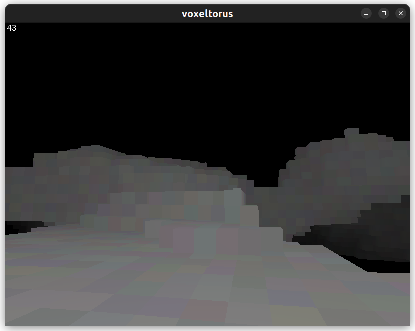

# voxeltorus

A raycasting voxel engine written in Rust using [Macroquad](https://github.com/not-fl3/macroquad).

To use it, clone the repository with git, then build and run:

```sh
git clone https://github.com/mdnestor/voxeltorus.git
cd voxeltorus
cargo build
cargo run --release
```

